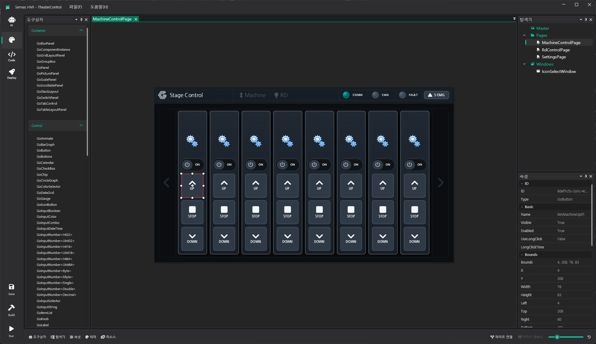
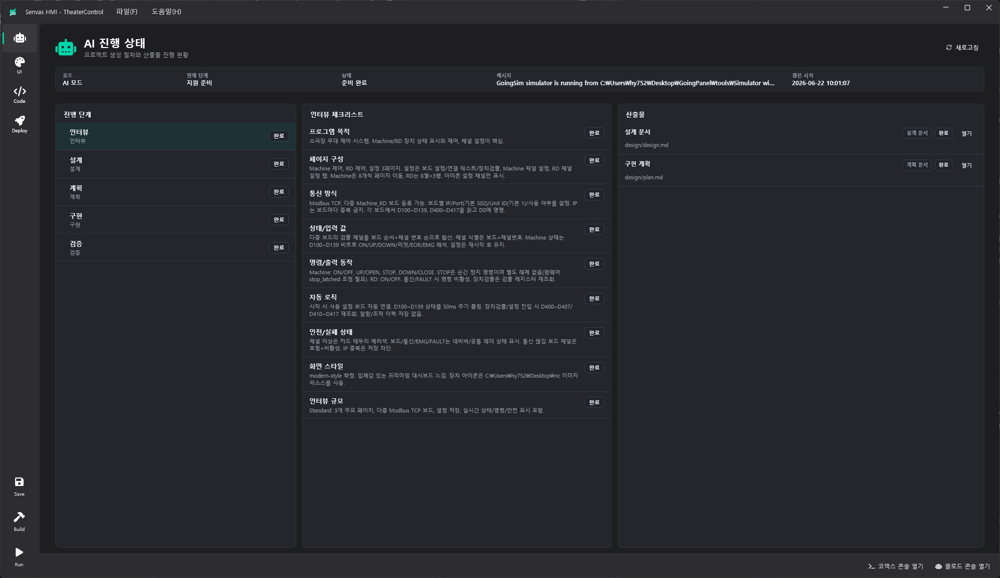
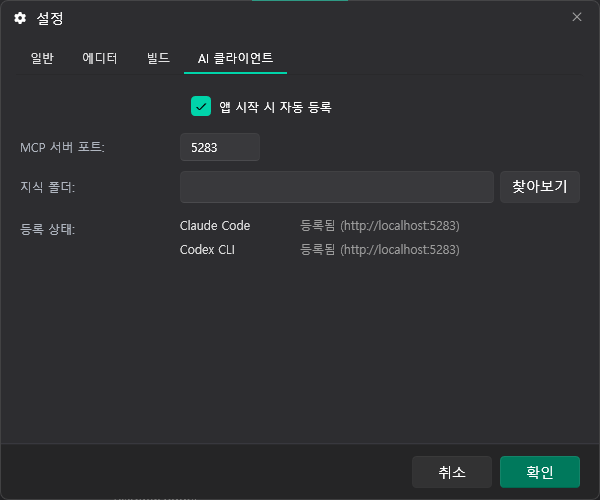
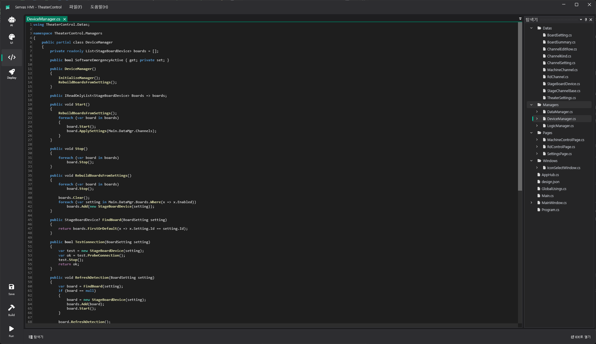
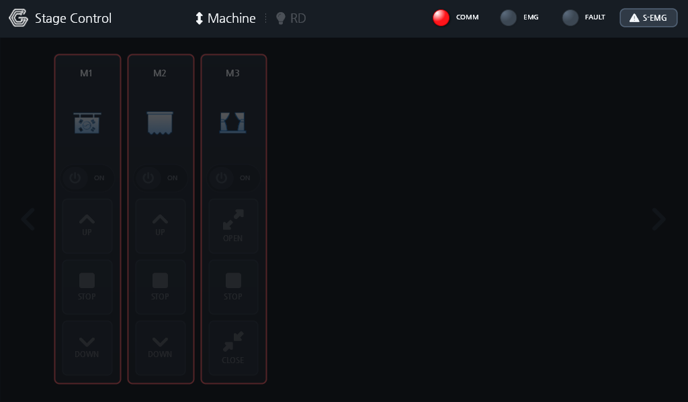

<a href="README.md">한국어</a> | <b>English</b>

  

<h1 align="center">Senvas HMI</h1>

An AI-assisted <b>industrial HMI</b> development platform, from design to touch-panel deployment

  <a href="https://github.com/going-kr/Release.Senvas/releases/latest"><b>⬇ Download Senvas-win-Setup.exe</b></a>
  &nbsp;·&nbsp; Windows 10/11 x64 &nbsp;·&nbsp; Korean UI

---

This repository distributes installers and auto-update artifacts only. The source code is kept private.

> ℹ️ The "Source code (zip / tar.gz)" links at the bottom of each release are added automatically by GitHub. They contain a snapshot of this distribution repository (README, images), not the Senvas source code.

## What is Senvas

Senvas is [Going](https://github.com/going-kr)'s industrial HMI development tool. You draw monitoring and control screens in the `.gudx` visual designer, fill in communication, logic and data in C#, and deploy the result to a Senvas Touch panel (linux-arm64) with one click. The AI workflow is what really sets it apart: Senvas embeds an MCP server that AI coding tools such as Claude Code and Codex CLI attach to, so the AI can build an entire project — from the requirements interview through screen design, planning, implementation and verification — and afterwards stay on as an assistant handling change requests.

## Workflow

1. New project — pick a screen size (say, 1280×800) and a theme, and Senvas creates the `.senvas` project along with the AI context files (`CLAUDE.md` / `AGENTS.md`).
2. AI creation — on the AI page, open the Claude console or Codex console and describe the HMI you want in a paragraph. The AI proceeds through Interview → Design → Plan → Implementation → Verification, and it always stops at Design and Plan to wait for your approval.
3. Edit — polish screens on the UI page and C# on the Code page. The AI stays available as an assistant for modifications.
4. Build / Run — code generation (MakeCode), then `dotnet build`, then run on Windows right away to check.
5. Deploy — Senvas Touch panels on the same network are discovered automatically; upload, install and start happen in one step.

## Features

### AI workflow (MCP)
Senvas hosts a built-in MCP server (`http://localhost:5283`) and registers it automatically with any installed Claude Code or Codex CLI. Through tool calls, the AI validates `.gudx`, generates code (MakeCode), adds image and font resources, sets up persistence, and registers progress and artifacts. It works from roughly 300 bundled knowledge documents (controls, communication, data, design, code patterns) plus workflow documents, which keeps its output in line with Senvas conventions. During verification it renders pages to PNG and inspects them visually to find and fix layout defects.

The AI page shows the current mode, phase and status, the interview checklist, and artifacts such as the design document and implementation plan. There is no chat window inside Senvas; you talk to the AI CLI you already use, and Senvas shows progress and results.

### UI designer
Drop containers, controls, image-canvas and flow-system parts from the toolbox onto the canvas and tune them in the property panel. Navigate Master, Pages and Windows in the explorer, manage colors in the theme editor and images/fonts in the resource panel. FlowSystem parts (tanks, pumps, valves, pipes) connect with the pipe tool to build P&ID-style process screens, and the HMI essentials — gauges, meters, trend/time graphs, bar and circle graphs, lamps, switches, data grids — come built in.

### Code
Every build regenerates `*.Designer.cs`, `design.json` and `GlobalUsings.cs` from `.gudx` (MakeCode), while communication, data and logic go into the user partials of `DeviceManager`, `DataManager` and `LogicManager`. Generated files are overwritten; user code is never touched. Edit in the Code page, or use Open in IDE to work in an external IDE. Generated projects are .NET 8 OpenTK/SkiaSharp apps (Going.UI) that run unchanged on both Windows and linux-arm64.

### Communication
Libraries for Modbus RTU/TCP (master and slave), MQTT, LS Electric CNet and the Mitsubishi MC protocol ship with usage-pattern documents, so the AI — or you — can write them straight into `DeviceManager`. The Senvas Touch serial-port assignment rules (1× RS-232, 3× RS-485) are part of the knowledge base and get applied during the interview.

### Persistence (optional)
If history or settings need to be stored, the MCP tool wires EF Core + SQLite into the project (adding packages and pinning a local `dotnet-ef` tool) and generates the migrations. Multiple `DbContext`s are supported too.

### Build · Run · Deploy
- Build: save → MakeCode → `dotnet build`, with the log streamed live.
- Run: launch the build output on Windows to check the screens.
- Deploy: `dotnet publish` (linux-arm64), zip, then upload, install and start on the discovered Senvas Touch panel. Panels are found via mDNS, and a device token is entered once on first connection. From the Deploy page you can also open the panel's web UI and start or stop the app on the device.

## Components

| Component | Runs on | Role |
|---|---|---|
| **Senvas editor** (distributed here) | Windows PC | Projects, UI designer, code editor, AI workflow (MCP), build, run, deploy |
| **Senvas Touch panel** | On site (linux-arm64 panel) | Runs the deployed HMI app; discovered via mDNS on the editor's network |

Panel-side software is not distributed from this repository. You can build and run on Windows without a panel.

## Requirements

| Item | Requirement |
|---|---|
| OS | Windows 10/11 x64. The editor is self-contained, so no separate .NET runtime install is needed |
| .NET 8 SDK | Build, Run and Deploy call `dotnet`, and generated projects target `net8.0`, so install it yourself → [Download .NET 8 SDK](https://dotnet.microsoft.com/download/dotnet/8.0). The `dotnet` path can be changed under Settings › Build |
| AI CLI | Claude Code and/or Codex CLI (for the AI workflow). When installed, Senvas registers its MCP server automatically at startup |
| Node.js + qmd | The knowledge search engine the AI uses. First-run onboarding installs Node.js LTS via `winget` and `qmd` via `npm`, then deploys the search index (skippable) |
| Deploy target | Senvas Touch panel on the same network (mDNS), plus a device token |

## Install (Windows)

1. Download `Senvas-win-Setup.exe` from the [latest release](https://github.com/going-kr/Release.Senvas/releases/latest) and run it.
2. The installer is signed with a self-signed certificate, so Windows SmartScreen may warn. Choose "More info", then "Run anyway".
3. The app installs per-user under `%LocalAppData%\Senvas`; no administrator rights needed. The .NET runtime it needs is bundled.
4. On first launch, onboarding offers to install Node.js + qmd (knowledge search). You can skip it, but it's worth doing for AI workflow quality.
5. If the .NET 8 SDK is missing, install the x64 SDK from [here](https://dotnet.microsoft.com/download/dotnet/8.0). Without it, Build fails (editing and saving still work). Check with `dotnet --list-sdks`.
6. With Claude Code or Codex CLI installed, Settings › AI clients shows them as "registered".

## Updating

Once installed, the app checks for a new version at startup, shows what's new, and applies it. You can also check any time via Help › Check for updates. The app restarts when an update is applied, so save your work first. There's no need to come back to this page.

## Release files

| File | Purpose |
|---|---|
| `Senvas-win-Setup.exe` | **Download this for a first install** |
| `Senvas-x.y.z-full.nupkg`, `*-delta.nupkg` | Auto-update packages, not meant for manual download |
| `RELEASES`, `releases.win.json`, `assets.win.json` | Auto-update metadata |
| (auto) `Source code (zip)`, `Source code (tar.gz)` | GitHub's automatic snapshot of this distribution repository. Not the Senvas source code; no need to download |

> `v1.1.x` tags are releases of the previous-generation product, SenvasHMI. For a new install, use the latest `v2.x`. The two products install side by side and do not update each other.

## Support

Please file bugs and requests in this repository's [Issues](https://github.com/going-kr/Release.Senvas/issues).

---

© Going. All rights reserved. Binaries are provided as-is. See [NOTICE.md](NOTICE.md).
